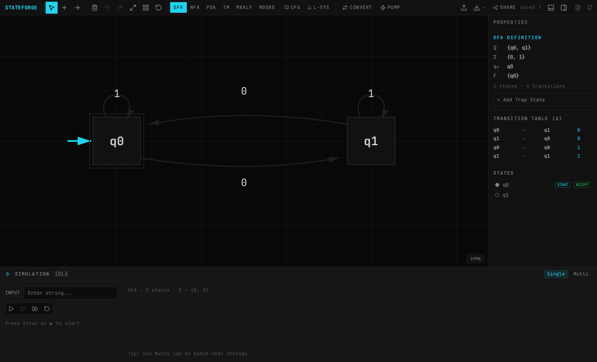

<div align="center">


# StateForge

**JFLAP for the modern web — build, simulate, and share automata in the browser.**

No install. No accounts. Just a URL.

[](https://stateforge.vercel.app)
[](LICENSE)

<br />



</div>

---

## ✨ Features

- 🔄 **DFA & NFA** — visual editor with step-through simulation and batch string testing
- 🔀 **NFA → DFA** — subset construction, step-by-step or all-at-once
- 📉 **DFA minimization** — table-filling algorithm with before/after view
- 🔗 **FA ↔ RegEx** — state elimination and Thompson's construction
- 📝 **Grammar editor** — context-free grammars with syntax highlighting and auto-classification
- 🔧 **Grammar transforms** — ε-removal, unit-removal, CNF, GNF
- 📚 **Pushdown automata** — PDA editor with live stack visualization
- 🖥️ **Turing machines** — tape visualization with head tracking and speed control
- ⚙️ **Mealy & Moore** — transducer simulation with output display
- 🌿 **L-Systems** — turtle graphics with iteration slider and fractal presets
- 🏋️ **Pumping lemma** — interactive game proving languages aren't regular/context-free
- 🔗 **URL sharing** — the entire automaton encodes into the URL hash
- 📂 **Import/export** — JFLAP `.jff` import, JSON export, PNG/SVG screenshots

## 🛠️ Tech Stack

- **Next.js** (static site, client-side only)
- **TypeScript**
- **Tailwind CSS**
- **Zustand** (state management + undo/redo)
- **HTML Canvas** (graph editor)
- **lucide-react** (icons)
- **lz-string** (URL compression)

## 🚀 Getting Started

```bash
git clone https://github.com/Royal-lobster/stateforge.git
cd stateforge
pnpm install
pnpm dev
```

Open [localhost:3000](http://localhost:3000) and start building automata.

## 📁 Architecture

```
src/
├── app/                # Next.js app router (layout, page, OG image)
├── components/         # Canvas, Toolbar, Sidebar, SimPanel, etc.
├── hooks/              # Custom React hooks
└── lib/                # Core logic (no React dependencies)
    ├── store.ts        # Zustand store (single source of truth)
    ├── types.ts        # TypeScript types
    ├── url.ts          # URL encode/decode (binary varint + lz-string)
    ├── conversions.ts  # NFA→DFA, minimization, RE conversions
    ├── grammar.ts      # Grammar parsing, transforms, CYK
    ├── pda.ts          # PDA simulation
    ├── tm.ts           # Turing machine simulation
    └── mealy-moore.ts  # Mealy/Moore machine simulation
```

## 📖 Docs

Full documentation at [stateforge.vercel.app/docs](https://stateforge.vercel.app/docs).

## 📄 License

MIT

<!-- last deploy: 2026-02-23 -->
